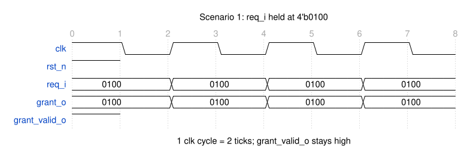
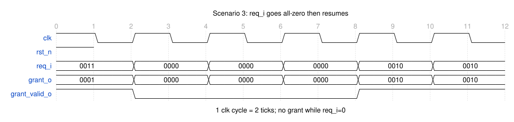
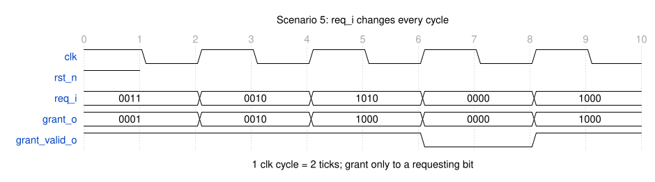

# REQ-001 轮询仲裁

> 本产物是**样例数据**：用于演示 spec-to-RTL 流程的追溯链，评审记录必须如实标注为样例评审，不得伪装成真实项目评审。
>
> **本版是 ③ 阶段触发的返工版**（2026-10-03）：③ 的 `grill-me` 讨论认定原 `F8` / 不变式 `I4` / 场景 4 要求的「复位断言期间输出必须为全 0」
> 会强制实现做输出组合门控；经人类裁决改为**复位只同步复位内部轮询指针、不强制清零输出**——删除 `I4`、重写 `F8`、重绘场景 4。
> 原 2026-09-23 的放行随内容变更作废，`status` 回到 `in_review`，同日经人类重放行（见「变更历史」）；此前的写作结构（软硬件接口结论式、硬件接口三段式）不变。
>
> **本文档只描述 IPO（输入 / 处理 / 输出）**：`req_i` 等输入、`grant_o` 等输出，以及两者之间的处理行为（`F*`）。
> **验收标准不在本阶段定义**——它由 ⑤ 验证阶段从 `F*`、接口不变式（I1~I3）与上述时序场景**扇出**为验收标准与 `TC-*` 测试点
> （见 `spec-to-rtl-verify` 技能与 `VP-*` 产物）。

## 背景与目标

多个请求者共享同一份下游资源（如一条总线、一个存储端口），需要仲裁器每周期至多放行一个请求者。
固定优先级的仲裁会让低优先级请求者在高优先级持续请求时长期得不到授权（饥饿）。

本功能点的目标：提供一个**轮询（round-robin）**仲裁器，使**持续请求的各个请求者获得服务的次数趋于均等**，
且在无请求时不占用下游资源、不产生误授权。

## 功能描述

- F1: 仲裁器有 `NUM_REQ` 个请求输入，任何时刻**至多授权一个**请求者；授权以 one-hot 形式输出。
- F2: 授权对象由**轮询指针**决定：指针指向的请求者优先级最高，其后按索引循环顺序（模 `NUM_REQ`）依次降低。
- F3: 每次发出授权后，指针移动到**本次被授权者之后的下一个索引**（`(granted + 1) mod NUM_REQ`），
  使下一次仲裁从被授权者的下家开始扫描。
- F4: 一次授权只持续一个时钟周期；被授权者在 `req_i` 保持有效期间，若其再次成为指针起点且无更靠前的有效请求，
  可以被再次授权（不强制插入空档）。
- F5: 当所有 `req_i` 均为 0 时：`grant_o` 全 0、`grant_valid_o` 为 0，且**轮询指针保持原值不变**。
- F6: 复位释放后，轮询指针指向索引 0，即复位后的第一次授权按「索引 0 优先」的固定顺序进行。
- F7: 输出只由被采样的输入与内部寄存状态唯一确定：同一组 `(req_i, 内部状态)` 下 `grant_o` 唯一确定，无毛刺、无振荡。
- F8: **复位只同步复位轮询指针**：`rst_n == 0` 期间，每个 `clk` 上升沿把指针置为索引 0（复位释放后满足 F6）；
  复位**不强制清零输出**——`grant_o` / `grant_valid_o` 仍由当时的 `req_i` 与指针唯一决定，因此复位断言期间可以照常出现有效授权。

## 软硬件接口（SW–HW Interface）

**结论：本功能点没有软件接口。** 无寄存器/CSR、无总线从接口、无中断、无状态回读；软件对本模块的唯一影响是综合期参数 `NUM_REQ`（elaboration 时固化），运行时软件不参与。

若后续需要软件配置（请求屏蔽 mask、使能、加权优先级、指针回读等），**必须另立 `REQ-*`**，并在该 REQ 里把总线从接口、寄存器表（`REGMAP-*`）、地址空间与访问属性一并详细描述——不塞进本功能点（见 non-goals）。

## 硬件接口（HW Interface）

### 参数表

| 参数 | 默认值 | 合法范围 | 含义 |
|---|---|---|---|
| `NUM_REQ` | 4 | 2 ~ 8 的整数 | 请求者数量；`1` 不合法（无轮询语义），`>8` 未定义（面积/编码逻辑未验证） |

参数在 elaboration 期固化，无运行时改写途径（见「软硬件接口」）。

### 接口信息

| 端口 | 方向 | 位宽 | 时钟域 | 复位值 | 含义 |
|---|---|---|---|---|---|
| `clk` | in | 1 | — | — | 唯一时钟；所有寄存器在其上升沿采样 |
| `rst_n` | in | 1 | `clk` | — | 同步复位，低有效；`0` = 复位断言（只复位内部轮询指针） |
| `req_i` | in | `NUM_REQ` | `clk` | —（由上游定义） | 请求向量，bit `k` = 第 k 个请求者申请授权 |
| `grant_o` | out | `NUM_REQ` | `clk` | —（不被复位，由 `req_i` 与指针决定） | 授权 one-hot 向量，bit `k` = 授权第 k 个请求者 |
| `grant_valid_o` | out | 1 | `clk` | —（不被复位，由 `req_i` 与指针决定） | `1` = 本拍存在有效授权 |

本接口未使用结构体（无 packed struct/union 端口或参数），故没有结构体成员表。

### 接口协议

**输入侧。** `req_i` 与 `rst_n` 都在 `clk` 上升沿被采样，必须由同一时钟域的寄存器驱动并满足 setup/hold。`req_i[k]=1` 表示第 k 个请求者在该采样点申请授权；请求者应保持 `req_i[k]=1` 直到本模块在该位给出授权（`grant_o[k]=1`），之后可在任意 `clk` 上升沿撤销。

**输出侧。** `grant_o` 与 `grant_valid_o` 在 `clk` 周期内有效，接收方在其后的 `clk` 上升沿采样。`grant_o` 采用 one-hot 编码：`grant_valid_o=1` 时 `grant_o` 恰有 1 位为 1；`grant_valid_o=0` 时 `grant_o` 全 0。无授权时输出全 0，不占用下游。

**握手与流控。** 本接口没有背压：不定义 `ready`/`ack` 类信号，授权是否被下游接受不在本接口范围内。

**复位。** `rst_n` 同步、低有效，只作用于内部轮询指针：`rst_n == 0` 期间的每个 `clk` 上升沿把指针置为索引 0，指针是唯一被复位的状态。输出不被复位门控——断言期间 `grant_o` / `grant_valid_o` 仍按输入侧与指针正常产生（`grant_o` 可以非 0、`grant_valid_o` 可以为 1）。断言宽度 ≥ 1 个 `clk` 上升沿，释放与 `clk` 同步。

**时钟。** 单时钟域。所有输入采样与输出有效窗口都以 `clk` 上升沿为基准；无跨时钟域处理、无异步复位、无时钟门控。

**接口不变式**（对任意输入都成立，供 ⑤ 写断言）：

| 编号 | 不变式 |
|---|---|
| I1 | `grant_o & (grant_o - 1) == 0`（one-hot 或全 0） |
| I2 | `(grant_o != 0) ⟺ (grant_valid_o == 1)` |
| I3 | `(grant_o & ~req_i) == 0`（不授权未请求者） |

以下场景只给**接口信号**（`clk` / `rst_n` / `req_i` / `grant_o` / `grant_valid_o`）的时序，不涉及内部实现；「为什么给出这个授权」属于功能行为，见「功能描述」。图源（`.json`）与渲染产物（`.svg`）都放在与本文件**同名的目录** `01-requirements/REQ-001-rr-arbitration/`，渲染方法与记法见该目录 `README.md`。记法：顶部数字为 tick 序号，**每 2 个 tick = 1 个 `clk` 周期**。

#### 场景 1：单请求者持续请求（`req_i = 4'b0100`）

**文字说明**：`req_i` 在每个 `clk` 上升沿都被采样为 `0100`；`grant_o` 恒为 `0100`、`grant_valid_o` 恒为 1——接收方可在每个 `clk` 上升沿采样到一次有效授权。

#### 场景 2：四请求者持续请求（`req_i = 4'b1111`）

**文字说明**：`req_i` 恒为 `1111`；`grant_o` 每周期给出一位有效的 one-hot 授权，`grant_valid_o` 恒为 1。接口上表现为「每周期一次授权、每次只有一位」，授权在 4 个 bit 间轮转。

#### 场景 3：请求全 0 期间与恢复

**文字说明**：`req_i` 从 `0011` 变为全 0 的周期里，`grant_valid_o` 为 0、`grant_o` 全 0；`req_i` 恢复为 `0010` 后输出重新有效。接口约定：无请求时不输出授权。

#### 场景 4：复位断言与释放

**文字说明**：`req_i` 恒为 `1111`。`rst_n` 拉低后的第一个 `clk` 上升沿把内部指针置回索引 0，`grant_o` 因此从 `0010` 回到 `0001`；断言期间输出**不被强制清零**——`grant_o` 仍逐拍有效、`grant_valid_o` 恒为 1。`rst_n` 释放后从索引 0 起继续轮询。

#### 场景 5：请求逐周期变化

**文字说明**：`req_i` 逐周期变化（`0011→0010→1010→0000→1000`）；`grant_o` 只出现在被请求的位上（满足 `grant_o & ~req_i == 0`），`req_i=0000` 的周期 `grant_valid_o` 为 0。

## 约束

| 类别 | 约束 | 来源 |
|---|---|---|
| 面积 | 首版目标 ≤ 150 个 sky130_fd_sc_hd 单元（`NUM_REQ=4`，不含测试逻辑）；精确预算由 ② 系统方案给出 | 本功能点 |
| 功耗 | 首版不设功耗门限，只要求无组合环路造成的动态翻转放大；`req_i` 全 0 时除时钟外无翻转 | 本功能点 |
| 时序 | 目标时钟 100 MHz（周期 10 ns）；单周期同步设计，输入采样与输出有效均以 `clk` 上升沿为基准 | 本功能点 |
| 工艺 | sky130 | 项目约定 |
| 其它 | RTL 必须能通过 Yosys + `sky130_fd_sc_hd` 综合；不使用不可综合结构 | 流程约定 |

## 不做的事（non-goals）

- **不提供任何软件接口**：无寄存器 / CSR、无总线从接口、无中断、无状态回读；软件只能通过综合期参数 `NUM_REQ` 间接影响行为（见「软硬件接口」）。
- 不做加权/优先级可配置仲裁（只做等权轮询）；加权需求另立 `REQ-*`。
- 不做跨时钟域处理：`req_i` 与 `grant_o` 均假设在 `clk` 单时钟域内，模块内不做同步器。
- 不处理背压/流水：授权后下游是否接受不在本功能点范围内；不提供 `ready` 类反压信号。
- 不做请求屏蔽（mask）、授权锁定（lock/keep）、超时/看门狗与错误上报。
- 不做时钟门控与低功耗状态机。

## 变更历史

| 日期 | 变更 | 影响的上游/下游 |
|---|---|---|
| 2026-09-19 | 初稿（样例数据） | — |
| 2026-09-21 | 第一次评审后返工：明确「无软件接口」并给出边界；新增端口表（驱动源/有效时刻）、信号级语义、5 条接口不变式、接口时序约定与 5 个场景时序图及逐拍信号语义；新增 F8（复位断言期间不授权）、AC-8；放行作废回到 `in_review` | 下游 ARCH-001 / DES-rra-001 / VP-rra-001 需按本版接口契约核对 |
| 2026-09-21 | 按评审意见把 5 张时序图从 ASCII 波形改为 **WaveDrom** 绘制，逐拍语义表保持不变 | 同上 |
| 2026-09-21 | 按评审意见调整图层布局：全部图件集中到与本文件**同名的目录** `01-requirements/REQ-001-rr-arbitration/`，WaveDrom 图源 `.json` 与渲染产物 `.svg` 同放该目录（含渲染说明与三个踩坑） | 同上；`artifacts` 路径随之更新 |
| 2026-09-21 | 按评审意见去重与收敛：①「软硬件接口」本模块无接口，改为一句结论 + 扩展边界（不再列「无」的逐项表，有接口时才详细描述）；②「验收标准」由复述行为的文字条目改为**判据表**（覆盖 F / 激励场景 / 观测点 / 量化判据），并写明 F（行为契约）与 AC（可观测判据）的分工，消除与「功能描述」的重复 | 同上；⑤ 的 `TC-*` 直接按 AC 表的观测点与判据落成 |
| 2026-09-21 | 按评审意见重排「硬件接口」章节为三段式：**参数表 → 接口信息（端口/方向/位宽/时钟域/复位值/含义；使用结构体时另加成员表）→ 接口协议（自然语言描述 + 每场景 WaveDrom 图与文字说明）**；原「信号级语义 / 接口不变式 / 接口时序约定 / 场景时序图」四节并入「接口协议」，端口表去掉驱动源与采样时刻两列（其内容写入协议正文） | 同上；③ 详设的端口表与协议描述按本结构对齐 |
| 2026-09-21 | 按评审意见把「接口协议」收敛为**只写接口**：删去内部实现与功能映射（指针推进、公平性推导、逐拍「为什么这样授权」），改为输入侧/输出侧/握手/复位/时钟五段同步逻辑描述；接口不变式只保留对任意输入可观测的 I1~I4（内部指针相关的 I5 移除）；时序图只画端口信号（去掉内部状态 `ptr_q`）并重渲；删除 `req_i→grant_o ≤ 5 ns` 与「无注册延迟」等组合路径/实现措辞 | 同上；⑤ 的 `TC-*` 只针对接口信号 |
| 2026-09-21 | 按评审意见把**验收标准从本文件扇出到 ⑤ 验证阶段**：删除「验收标准」整节（原 AC-1~AC-8 判据表），本文档只保留 IPO（输入 / 处理 / 输出）；验收标准由 ⑤ 从 `F*`、接口不变式 I1~I4 与时序场景扇出为 `TC-*` | ⑤ 的 `VP-rra-001` 必须覆盖每个 `F*` 与 I1~I4；合同文件（模板/清单/技能）同步 |
| 2026-09-23 | **人类放行**：`status: approved`，`reviewer: qiankun214（样例评审）`（样例数据，如实标注为样例评审，非真实项目评审记录）；本版作为 ② 系统方案的上游契约 | 解锁 ② `ARCH-001`（可引用 REQ-001） |
| 2026-10-03 | ③ `grill-me` 触发返工：删除接口不变式 `I4`；`F8` 由「复位断言期间输出必须全 0」改为「复位只同步复位轮询指针、不强制清零输出」；端口表 `grant_o` / `grant_valid_o` 的复位值列、接口协议「复位」段、场景 4 图与文字说明同步重绘；原 2026-09-23 放行随内容变更作废，`status` 回到 `in_review` | ①② 需重新核对（`ARCH-001` 引用本接口）；⑤ 不再断言 `I4`；③ 的 `DES-rra-001` 按新口径设计 |
| 2026-10-03 | 返工版**人类重放行**（`status: approved`，`reviewer: qiankun214（样例评审）`）后复核图件，又发现并修正场景 4 一拍错位：同步复位在 `rst_n` 拉低后的**第一个** `clk` 上升沿即生效，断言期间 `grant_o` 应为 `0010 → 0001 → 0001`（原重绘误写为 `0010 → 0100 → 0001`），并把 `rst_n` 拉低沿移到上升沿之前以消除「边沿是否采到复位」的歧义；图件内容修正按约定 #6 再次作废放行，同日按修正后图件重放行。`F8` 语义未变 | ③ 按修正后波形设计；解锁 ③；② `ARCH-001` 恢复通过 |
