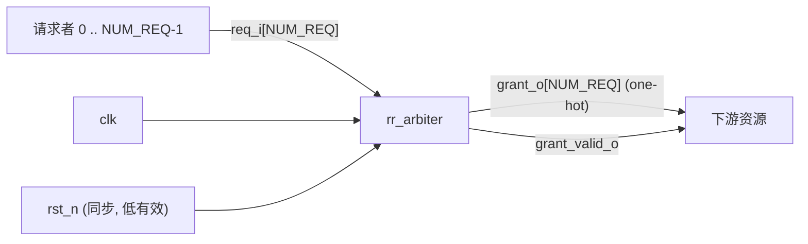

# ARCH-001 框图 — 轮询仲裁器（模块级）

> 只画到 module 边界；模块内部结构属 ③ 详细设计。



```
 请求者 0..N-1 ──req_i[N]────────▶ ┌─────────────┐ ──grant_o[N] (one-hot)──▶ 下游资源
                                   │ rr_arbiter  │ ──grant_valid_o─────────▶
              clk ───────────────▶ │ (唯一 module)│
   rst_n (同步, 低有效) ──────────▶ └─────────────┘
```

端口与信号语义见 `REQ-001` 的硬件接口章节（此处不复述）。只有一个 module，无模块间连接。
