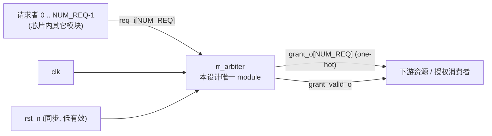

# ARCH-001 框图 — 轮询仲裁器（模块级）

> 本图是 `02-architecture/ARCH-001-arb-arch.md` 的支撑材料，属于**样例数据**（spec-to-RTL 流程演示）。
> 按 ② 阶段约定，框图**只画到 module 边界**：module 内部的功能块、FSM、数据通路属于 ③ 详细设计，不在本图展开。

## 系统上下文（模块边界与对外连接）



ASCII 版本：

```
 请求者 0..N-1 ──req_i[N]────────▶ ┌──────────────┐ ──grant_o[N] (one-hot)──▶ 下游资源
                                   │  rr_arbiter  │ ──grant_valid_o─────────▶
              clk ───────────────▶ │  (唯一 module)│
   rst_n (同步, 低有效) ──────────▶ └──────────────┘
```

- 端口名、位宽、时钟域、复位值与信号语义：**以 `REQ-001-rr-arbitration.md` 的「硬件接口 → 接口信息 / 接口协议」为唯一权威**，
  本图不复述、本文件不重复维护。
- 只有一个 module，**无模块间连接**（连接框图与模块间接口表在本设计中为空，理由见 ARCH-001「模块间连接」）。

## 内部结构（不在本阶段定义）

模块内部的实现划分（轮询指针寄存器、掩码生成、两段优先级编码、输出门控）与关键路径分析，
由 ③ 的 `DES-rra-001` 定义并配详设图；本阶段不预设内部结构，避免与 ③ 的取舍冲突。
