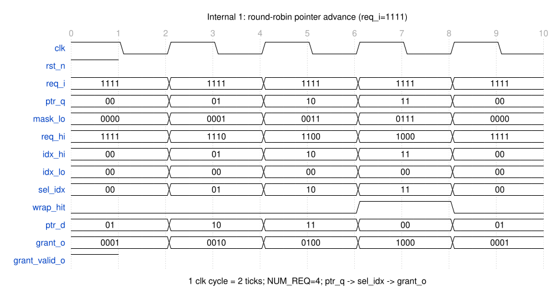
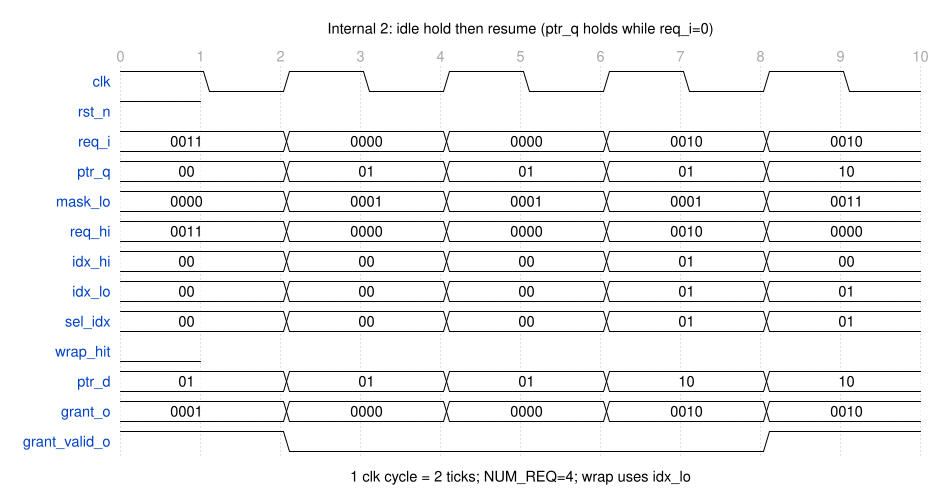
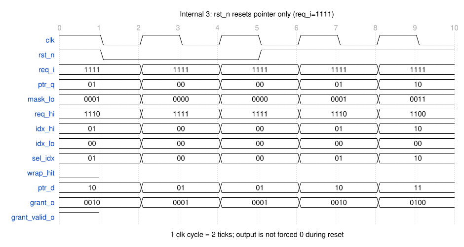
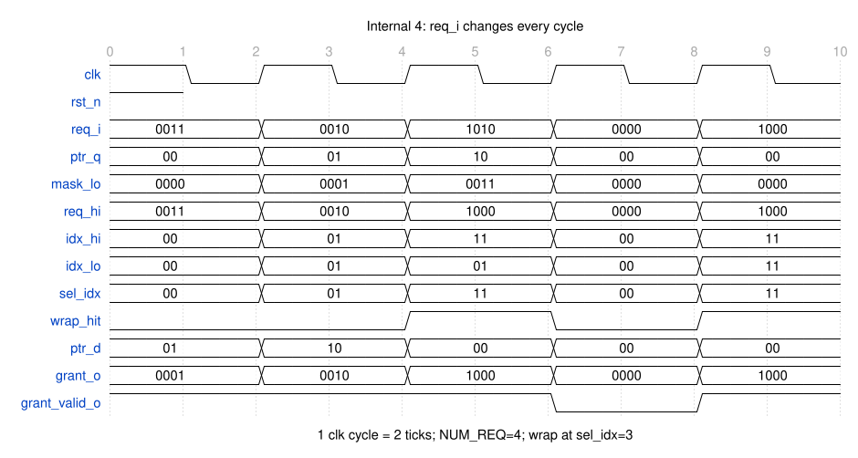

# DES-rra-001 轮询仲裁策略

> 模块：`rr_arbiter`　短名：`rra`　对应 RTL：`04-rtl/rr_arbiter/rr_arbiter.sv`

> 本产物是该模块的**唯一 RTL 契约**：④ 的端口与行为必须逐条对照本文，不得出现本文没有的端口或行为。
> **接口契约以 `REQ-001` 为唯一权威**（端口语义、参数范围、接口协议、接口不变式）——见 `REQ-001` 硬件接口，本文不重述。
> 本文只写本阶段新增结论：数据通路/控制通路实现概要、实现规划（寄存器与组合变量清单）、复位、边界条件、时序假设、可综合性。
> 命名与编码风格遵循 `standards/coding-standard.md`；该文件当前仍是 **PLACEHOLDER 占位规范**，
> 因此④ 的 RTL 属「依赖 placeholder 规范」。
> 本文由 ③ 阶段的 `grill-me` 讨论产出，决策过程见「变更历史」。

## 端口表

与 `REQ-001` 硬件接口的端口表逐条一致（本表是 ④ 写 RTL 端口的直接依据）：

| 端口 | 方向 | 位宽 | 时钟域 | 复位值 | 含义 |
|---|---|---|---|---|---|
| `clk` | in | 1 | — | — | 唯一时钟；`ptr_q` 在其上升沿更新 |
| `rst_n` | in | 1 | `clk` | — | 同步复位，低有效；**只复位 `ptr_q`**（`REQ-001` F8） |
| `req_i` | in | `NUM_REQ` | `clk` | —（由上游定义） | 请求向量，bit `k` = 第 k 个请求者申请授权 |
| `grant_o` | out | `NUM_REQ` | `clk` | —（组合输出，不被复位） | 授权 one-hot 向量 |
| `grant_valid_o` | out | 1 | `clk` | —（组合输出，不被复位） | `1` = 本拍存在有效授权 |

不使用结构体端口/参数。端口顺序按 `coding-standard` §4.1：`clk` → `rst_n` → 输入 → 输出。

### 端口时序

端口级时序以 `REQ-001` 硬件接口的 5 个 WaveDrom 场景为**唯一权威**，本阶段**不重画**（避免与上游漂移）。本设计关心的事件与上游场景的对应关系：

| 本设计关心的事件 | `REQ-001` 场景 |
|---|---|
| 单请求者持续请求时的授权 | 场景 1（`req_i = 0100`） |
| 多请求者竞争下的轮询公平性 | 场景 2（`req_i = 1111`） |
| 无请求时不授权、指针保持 | 场景 3（`req_i` 全 0 与恢复） |
| 复位只复位指针、输出不被清零 | 场景 4（`rst_n` 断言与释放） |
| 请求逐拍增删 | 场景 5（`req_i` 逐周期变化） |

③ 新增的**内部时序**见「内部时序」一节。

## 参数

| 参数 | 默认值 | 合法范围 | 含义 |
|---|---|---|---|
| `NUM_REQ` | 4 | 整数 2 ~ 8 | 请求者数量；同时决定 `req_i` / `grant_o` 位宽与指针位宽 |

派生常量（`localparam`，不对外）：`IDX_W = $clog2(NUM_REQ)`。`NUM_REQ=2/4/8` 时为 1/2/3 位；非 2 的幂时向上取整，指针取值仍限制在 `0..NUM_REQ-1`。

**非法参数行为**：`NUM_REQ < 2`（无轮询语义）或 `NUM_REQ > 8`（未验证）时，RTL 在 `generate` 块内用 `$error` 于 **elaboration 期**报错终止——已实测 Verilator `--lint-only` 退出码 1、Yosys 读入该参数时报 `ERROR`，综合与仿真都不会静默生成错误逻辑。该行为属 elaboration 行为，⑤ 无法用常规激励覆盖，在 `VP-*` 中记为「不可用激励覆盖，由 ④ 的静态检查核对」。

## 数据通路实现概要

**目标**：由 `req_i` 与指针 `ptr_q` 组合选出「唯一一个」被授权者，输出 one-hot 的 `grant_o`，并给出指针次态 `ptr_d`。全部为组合逻辑，无流水级。

**实现步骤**：

1. **低位段掩码** `mask_lo`：把指针之前的索引圈出来，`mask_lo[k] = (k < ptr_q)`（等价于在 `NUM_REQ` 位宽内计算 `(1 << ptr_q) - 1`）。
2. **高段候选** `req_hi = req_i & ~mask_lo`：`REQ-001` F2 里「索引 ≥ `ptr_q`」的候选请求。
3. **两段最低有效位优先编码**：`idx_hi` / `idx_lo` 与各自的扫描标志 `hi_found` / `lo_found` 合在**同一个** `always_comb`（四者同属一个优先编码器，属强关联信号）：`for` 从低位向高位扫描，命中第一个有效请求位即锁定（标志置 1），得到该段的最低有效位索引。
4. **选择** `sel_idx`：`req_hi != 0` 取 `idx_hi`，否则取 `idx_lo`（`if`/`else`）——高段有候选就取高段（指针起点优先），否则回绕取 `req_i` 的最低位，即 `REQ-001` F2「其后按索引循环顺序依次降低」。
5. **one-hot 展开** `grant_o`：`grant_valid_o = 1` 时 `grant_o = one-hot(sel_idx)`，否则全 0（`if`/`else`，不用三目）。
6. **指针次态** `ptr_d`：默认 `ptr_d = ptr_q`；`grant_valid_o = 1` 时若 `wrap_hit` 则置 0，否则 `sel_idx + 1`（`if`/`else`）。`wrap_hit = (sel_idx == NUM_REQ-1)`——`REQ-001` F3 的「推进到被授权者的下一个索引」，回绕用索引比较而非取模。

**与 RTL 编码风格的对应**（④ 技能硬性要求，评审逐条核对）：`mask_lo` / `req_hi` / `grant_valid_o` / `wrap_hit` 各由**一条 `assign`** 给出；`sel_idx` / `grant_o` / `ptr_d` 各由**一个只给它赋值的 `always_comb`**（内部用 `if`/`else`，**不用嵌套三目**）；只有**强关联**的 `idx_hi` / `idx_lo` / `hi_found` / `lo_found` 合在同一个 `always_comb`。④ 不得把无关信号合进同一个块。

**优先编码的零输入口径**：`hi_found` / `lo_found` 在对应输入全 0 时保持 0，`idx_hi` / `idx_lo` 编码为 `0`。由于 `sel_idx` 的选择条件是 `req_hi != 0`，`idx_hi` 的零值只在 `req_hi == 0` 时被丢弃；而 `req_i == 0` 时 `grant_valid_o = 0`、`grant_o = 0`、指针保持，`sel_idx` 不参与输出与推进。

**位宽与推导**（无隐式截断）：

| 信号 | 位宽 | 推导 |
|---|---|---|
| `ptr_q` / `ptr_d` | `IDX_W` | 指针现态 / 次态，取值 `0..NUM_REQ-1` |
| `mask_lo` | `NUM_REQ` | `mask_lo[k] = (k < ptr_q)`，在 `NUM_REQ` 位宽内计算 |
| `req_hi` | `NUM_REQ` | `req_i & ~mask_lo` |
| `idx_hi` / `idx_lo` | `IDX_W` | 两段各自的最低有效请求位索引（由带扫描标志的优先编码得到） |
| `hi_found` / `lo_found` | 1 | 优先编码的扫描标志（命中即锁定），与 `idx_*` 同属一个编码器 |
| `sel_idx` | `IDX_W` | 选中索引 |
| `grant_o` | `NUM_REQ` | one-hot 展开，在 `NUM_REQ` 位宽内计算 |
| `grant_valid_o` | 1 | `|req_i` |

`ptr_d` 的 `sel_idx + 1` 只在 `sel_idx != NUM_REQ-1` 时生效，不会溢出到非法索引；**无溢出/饱和问题**（回绕靠索引比较实现，不使用 `%`/除法）。

**输入不打拍**：`req_i` **不额外寄存**，直接参与组合仲裁——这是组合透传授权的必要条件；它与 `clk` 的同步关系由上游按 `REQ-001` 接口协议保证。

**关键组合路径**：`ptr_q` → `mask_lo` → `req_hi` → `idx_hi` / `idx_lo` → `sel_idx` → `grant_o`（`grant_valid_o` 直连 `|req_i`）；另有 `sel_idx` → `wrap_hit` → `ptr_d` → `ptr_q` 的 D 端。

## 控制通路实现概要

**结论：不使用状态机（FSM）。** 理由：本模块每个 `clk` 周期都独立完成一次仲裁并给出授权，不存在需要跨周期区分的相位或握手；`REQ-001` 同时要求授权**组合透传**（场景 3/5：`req_i=0` 当拍 `grant_valid_o` 立即为 0）与 F3「每次授权当拍推进指针」。若另加控制状态寄存器：让它参与输出就会破坏组合透传，不参与输出就是**不被读取的死状态**（综合会被优化掉、lint 报未使用），让它门控指针推进则会在「空闲后首次授权」等序列上违反 F3。因此唯一的时序状态就是轮询指针 `ptr_q`，控制通路是**纯组合的条件选择 + 一个带使能的寄存器更新**。

控制通路的职责与条件动作：

| 控制条件 | 动作 | 依据 |
|---|---|---|
| `rst_n == 0`（复位断言） | `ptr_q` 在 `clk` 上升沿置 0；输出**不门控**（照常由 `req_i` 与 `ptr_q` 组合决定） | `REQ-001` F8、场景 4 |
| `req_i == 0`（无请求） | `grant_o = 0`、`grant_valid_o = 0`；`ptr_d = ptr_q`（指针保持） | `REQ-001` F5 |
| `req_i != 0`（有请求） | `grant_valid_o = 1`、`grant_o` 由 `sel_idx` 展开；`ptr_q` 装 `ptr_d`（推进到被授权者下家，`NUM_REQ-1` 时回到 0） | `REQ-001` F2/F3/F4 |

条件「`req_i == 0`」与「`req_i != 0`」互斥且穷尽；复位优先级最高，在 `clk` 上升沿覆盖指针更新。

## 实现规划

### 寄存器清单

| 名称 | 类 | 位宽 | 复位值 | 复位方式 | 含义 | 驱动来源 | 被谁使用 |
|---|---|---|---|---|---|---|---|
| `ptr_q` | 寄存器 | `IDX_W` | `0`（指向索引 0） | **同步**、低有效 `rst_n` | 轮询指针现态：下一次仲裁的起点索引 | `ptr_d`（`rst_n==0` 时被复位值覆盖） | `mask_lo`、`ptr_d` 的组合逻辑 |

除 `ptr_q` 外**没有其它寄存器**（`grant_o` / `grant_valid_o` 为组合输出，不入寄存器）。

### 组合变量清单

| 名称 | 类 | 位宽 | 含义 | 驱动来源 | 被谁使用 |
|---|---|---|---|---|---|
| `mask_lo` | 组合 | `NUM_REQ` | 「索引 < `ptr_q`」的低位段掩码 | `ptr_q` | `req_hi` |
| `req_hi` | 组合 | `NUM_REQ` | 「索引 ≥ `ptr_q`」的高段候选请求 | `req_i`、`mask_lo` | `idx_hi`、`sel_idx` 选择 |
| `idx_hi` | 组合 | `IDX_W` | `req_hi` 的最低有效请求位索引 | `req_hi`、`hi_found` | `sel_idx` |
| `idx_lo` | 组合 | `IDX_W` | `req_i` 的最低有效请求位索引（回绕段） | `req_i`、`lo_found` | `sel_idx` |
| `hi_found` | 组合 | 1 | 高段优先编码的扫描标志（命中即锁定） | `req_hi` | `idx_hi` |
| `lo_found` | 组合 | 1 | 回绕段优先编码的扫描标志（命中即锁定） | `req_i` | `idx_lo` |
| `sel_idx` | 组合 | `IDX_W` | 本拍被选中的请求者索引 | `req_hi`、`idx_hi`、`idx_lo` | `grant_o`、`wrap_hit`、`ptr_d` |
| `wrap_hit` | 组合 | 1 | `sel_idx == NUM_REQ-1`，即推进需要回绕到 0 | `sel_idx` | `ptr_d` |
| `ptr_d` | 组合 | `IDX_W` | 指针次态 | `grant_valid_o`、`wrap_hit`、`sel_idx`、`ptr_q` | `ptr_q` 的 D 端 |
| `grant_o` | 组合 | `NUM_REQ` | 授权 one-hot 向量（`grant_valid_o=0` 时为全 0） | `sel_idx`、`grant_valid_o` | 输出端口 |
| `grant_valid_o` | 组合 | 1 | 本拍是否存在有效授权 | `req_i` | 输出端口、`grant_o`、`ptr_d` |

**命名约定**：寄存器现态/次态用 `_q`/`_d`，端口用 `_i`/`_o`，低有效复位用 `_n`（`coding-standard` §1.3）。④ 的 RTL 信号名必须与本清单一致；需要新增本清单之外的信号时，先回到本阶段改详设并重新放行。

## 内部时序

> 图源（`.json`）与渲染产物（`.svg`）都放在与本文件**同名的目录** `03-design/rr_arbiter/DES-rra-001-arbitration-policy/`，渲染方法与记法见该目录 `README.md`。
> **端口时序见 `REQ-001` 的 5 个场景**（本阶段不重画）；本节的图在端口之外增加**主要内部信号**（`ptr_q` / `mask_lo` / `req_hi` / `idx_hi` / `idx_lo` / `sel_idx` / `wrap_hit` / `ptr_d`），取 `NUM_REQ=4` 便于阅读。
> 记法：每 2 个 tick = 1 个 `clk` 周期；`ptr_q` 在上升沿更新，组合信号与同拍的 `req_i`、`ptr_q` 对应；`c0..c4` 表示第 0~4 个 `clk` 周期。

### 内部时序 1：连续请求下的轮询推进（`req_i = 1111`）

**说明**：c0 `ptr_q=00`、`req_hi=1111` → `sel_idx=0`、`grant_o=0001`、`ptr_d=01`；c1 `req_hi=1110` → `sel_idx=1`、`0010`、`ptr_d=10`；c2 `req_hi=1100` → `sel_idx=2`、`0100`、`ptr_d=11`；c3 `req_hi=1000` → `sel_idx=3`、`1000`，此时 `sel_idx = NUM_REQ-1` 使 `wrap_hit=1`、`ptr_d=00`；c4 指针回到索引 0，重新 `sel_idx=0`、`0001`。即 `REQ-001` F2/F3 的「指针起点优先 → 授权后推进到下家 → 回绕」。

### 内部时序 2：空闲保持与恢复

**说明**：c0 `req_i=0011`、`ptr_q=00` → `sel_idx=0`、`grant_o=0001`、`ptr_d=01`。c1/c2 `req_i=0000`：`grant_valid_o=0`、`grant_o=0000`，且 `ptr_d = ptr_q = 01`（**指针保持**，`REQ-001` F5）。c3 `req_i=0010`、`ptr_q=01`：`req_hi=0010` 非 0 → `sel_idx=01`（授权 index 1）、`ptr_d=10`。c4 `ptr_q=10`：`req_hi = 0010 & ~0011 = 0000` → 走**回绕段** `idx_lo=01`，仍选中 index 1、`ptr_d=10`（被授权者持续请求时的再次授权，`REQ-001` F4）。

### 内部时序 3：复位只复位指针（`req_i = 1111`）

**说明**：`rst_n` 在 c1 之前拉低。c0 `ptr_q=01` → `grant_o=0010`、`ptr_d=10`；c1 的上升沿 `rst_n=0`，`ptr_q` 被**同步置 0**，而 `grant_o` **不被清零**——`ptr_q=00` 使 `sel_idx=00`、`grant_o=0001`、`grant_valid_o=1`；c1/c2 的 `ptr_d=01` 表示「若不复位本应推进到 1」，但复位在时钟沿覆盖它，`ptr_q` 保持 0；c3 释放后从索引 0 起继续轮询（`0010`），c4 为 `0100`。端口表现与 `REQ-001` 场景 4 完全一致。

### 内部时序 4：请求逐拍变化

**说明**：`req_i` 逐拍 `0011 → 0010 → 1010 → 0000 → 1000`。c0/c1 分别选中 index 0/1；c2 `req_i=1010`、`ptr_q=10` → `req_hi=1000` → `sel_idx=3`、`grant_o=1000`，`wrap_hit=1` 使 `ptr_d=00`；c3 `req_i=0000` → `grant_valid_o=0`、`grant_o=0000`、`ptr_d = ptr_q` 保持 `00`；c4 `req_i=1000`、`ptr_q=00` → 再次选中 index 3、`ptr_d=00`。端口表现与 `REQ-001` 场景 5 完全一致。

## 复位与初值

| 寄存器 | 复位值 | 复位方式 | 理由 |
|---|---|---|---|
| `ptr_q` | 全 0（指向索引 0） | **同步**、低有效 `rst_n` | `coding-standard` §2.5 默认同步复位低有效；单时钟域、无异步复位需求；`REQ-001` F6/F8 要求复位把指针置为索引 0 |

- `grant_o` / `grant_valid_o` 为组合输出，**不被复位门控**——`REQ-001` F8 规定复位断言期间输出仍由 `req_i` 与 `ptr_q` 决定，可以照常给出有效授权。
- `ptr_q` 只在 `clk` 上升沿更新：`rst_n == 0` 时置 0，否则装载 `ptr_d`。
- 复位断言期间每个上升沿都把 `ptr_q` 置 0，因此只要 `req_i` 非 0，`grant_o` 就指向索引 0 优先级下的最低有效请求位（`REQ-001` 场景 4 断言期间的 `0001` 即此表现）。

## 边界条件

| 场景 | 处理策略 |
|---|---|
| `req_i` 全 0 | `grant_valid_o = 0`、`grant_o = 0`；`ptr_d = ptr_q`（指针保持）——`REQ-001` F5 |
| 同时多个请求 | 按 `REQ-001` F2：从 `ptr_q` 起按索引循环顺序取第一个有效请求——`req_hi != 0` 时取 `idx_hi`，否则回绕取 `idx_lo` |
| 请求在授权当拍撤销 | 组合透传：当拍 `req_i` 一变，`grant_o` / `grant_valid_o` 当拍即反映；该拍无请求则指针不动 |
| 被授权者持续请求 | 允许连续授权（`REQ-001` F4）：指针推进到被授权者的下家，回绕后仍可再次选中它 |
| 参数极值 `NUM_REQ = 2` | `IDX_W = 1`；两段退化为「bit1 优先，回绕 bit0」，无特殊分支 |
| 参数极值 `NUM_REQ = 8` | `IDX_W = 3`；`mask_lo` / `grant_o` 8 位；指针范围 `0..7` |
| 非 2 的幂 `NUM_REQ = 3/5/6/7` | 掩码与 one-hot 均在 `NUM_REQ` 位宽内计算；指针范围靠 `wrap_hit` 的回绕条件限制，不使用取模，不会产生非法索引 |
| 非法参数 `NUM_REQ < 2` 或 `> 8` | elaboration 期 `$error` 终止（见「参数」），不进入功能逻辑 |
| 背压 / 流控 | 本接口无背压（`REQ-001` non-goals），不处理，也不生成 `ready`/`ack` 类信号 |
| 复位断言期间的输入 | `req_i` 为位向量，任意取值都合法；复位只作用于 `ptr_q`，输入照常参与组合授权 |

## 时序假设

- **单周期、无流水、无 CDC**：一次仲裁在 1 个 `clk` 周期内完成，下游在下一个 `clk` 上升沿采样。
- **目标频率**：沿用 `REQ-001` 约束的 100 MHz（周期 10 ns）。
- **不写 ns 级组合路径预算**：本阶段不做工艺特性化，预算数字与 PDK 角落强相关，留到 ⑥ 用 sky130 综合与报告对照；本阶段的确定结论是「存在一条 `ptr_q` → `grant_o` 的单周期组合路径，需在 100 MHz 内收敛，不插流水、不加流水级」。
- **对上游的时序要求**：`req_i` / `rst_n` 由同一 `clk` 域的寄存器驱动并满足 setup/hold（`REQ-001` 接口协议）；本模块不额外要求任何握手时序。

## 可综合性（Yosys + sky130）

| 用到的结构 | 可综合性 |
|---|---|
| `parameter` / `localparam` / `$clog2` | 常量求值，可综合 |
| `1 << ptr_q` 形式的变量移位与 `- 1` 掩码 | 综合为译码/移位组合逻辑，Yosys 可映射到 sky130 组合单元 |
| `for` 循环逐位优先编码（`always_comb` + 默认赋值 + 扫描标志） | 展开为组合逻辑；所有分支有默认赋值，无 latch |
| 相等比较 `sel_idx == NUM_REQ-1`、逻辑与/或/非 | 映射到 `sky130_fd_sc_hd` 组合单元 |
| `always_ff @(posedge clk)` 中的 `IDX_W` 位寄存器 | 映射为 `sky130_fd_sc_hd__dfxtp` 类触发器（≤3 个） |
| 阵列 / 存储器 | **不使用**，不存在「存储器退化为触发器」的代价 |
| `%` / 除法 / 实数 / 动态数组 / `struct` | **不使用**（回绕靠索引比较实现），符合 `coding-standard` §5 |

## 变更历史

| 日期 | 变更 | 影响 |
|---|---|---|
| 2026-10-03 | 初稿：由 ③ `grill-me` 讨论产出——单模块、二进制指针 `ptr_q` + 两段掩码优先级编码；授权组合透传；仅 `ptr_q` 同步复位、输出不门控；非法参数 elaboration `$error`；不写 ns 预算、留 ⑥ 综合对照 | ④ 的 RTL 契约；⑤ 的边界测试点依据 |
| 2026-10-03 | 按人类评审意见重构正文结构：新增「数据通路实现概要」「控制通路实现概要」「实现规划（寄存器 + 全部组合变量清单）」三节；控制通路明确**不使用 FSM** 并给出理由（避免死状态或破坏组合透传/当拍推进）；原「状态机」「数据通路」两节并入上述三节；该结构回流到 DES 模板、③ 技能与 `03-design/README.md` | ④ 按新的信号清单与命名写 RTL；③ 产物结构约定更新 |
| 2026-10-03 | 按人类评审意见补时序规划：新增「端口时序」（引用 `REQ-001` 的 5 个场景，不重画）与「内部时序」（4 张 WaveDrom 图：轮询推进 / 空闲保持 / 复位只复位指针 / 请求逐拍变化，图件与图源入同名目录并计入 `artifacts`）；补充「优先编码零输入口径」（`idx_*` 全 0 时编码 0，被 `req_hi != 0` 屏蔽）；该结构回流到 DES 模板、③ 技能与 README | ④ 按内部时序图核对 `ptr_q`/`sel_idx`/`ptr_d`；⑤ 可据内部时序写断言 |
| 2026-10-03 | **人类放行**：`status: approved`，`reviewer: qiankun214（样例评审）`（样例数据，如实标注为样例评审，非真实项目评审记录）；本版作为 ④ RTL 的唯一契约 | 解锁 ④；④ 的端口/信号名/时序逐条对照本产物 |
| 2026-10-03 | 按人类评审提出的**编码风格要求**（一个 `always` 块/`assign` 只给一个变量赋值，强关联信号可同块；禁止嵌套三目）调整实现描述：`mask_lo` / `req_hi` / `grant_valid_o` / `wrap_hit` 各用一条 `assign`；`sel_idx` / `grant_o` / `ptr_d` 各用一个只给它赋值的 `always_comb`（`if`/`else`）；优先编码的 `idx_hi` / `idx_lo` 与扫描标志 `hi_found` / `lo_found` 作为强关联信号同块；**不新增信号**（`hi_found` / `lo_found` 补入组合变量清单，此前 RTL 已有但清单漏列）。风格要求回流到 ④ 技能、`tools/templates/RTL.template.sv` 与评审清单 §E。原放行随内容变更作废，`status` 回到 `in_review` | ④ 按新信号清单与分块风格重写 RTL；⑤ 的 `TC-*` 观测判据不变（行为等价） |
| 2026-10-03 | **人类重放行**（`status: approved`，`reviewer: qiankun214（样例评审）`）：确认「不新增信号、强关联同块」的口径；④ RTL 已按此重写，回归 40/40 通过、覆盖率 line 100.0% / toggle 96.9%（与改风格前一致） | 解锁 ④/⑤ 复跑；本版仍为 RTL 唯一契约 |
