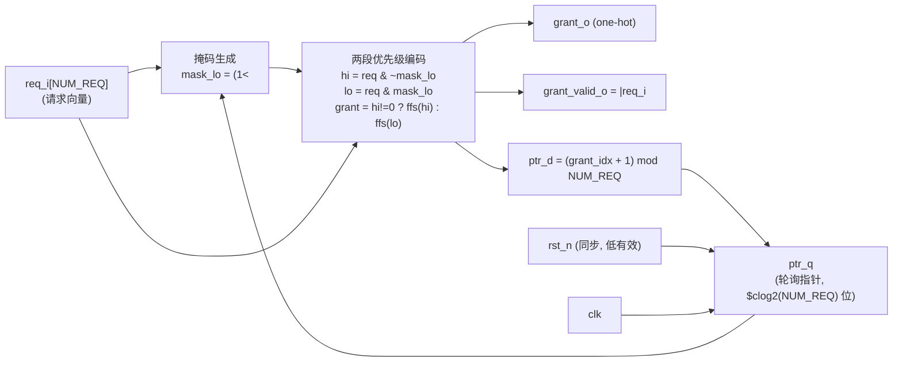

# ARCH-001 框图 — 轮询仲裁器

> 本图是 `02-architecture/ARCH-001-arb-arch.md` 的支撑材料，属于**样例数据**（spec-to-RTL 流程演示）。
> 图用 Mermaid 描述，GitHub / 支持 Mermaid 的 Markdown 预览器可直接渲染；下方保留 ASCII 版本以便纯文本阅读。

## 数据通路框图



ASCII 版本：

```
 req_i[N-1:0] ───────────────┐
                             ▼
 ptr_q ──► mask_lo=(1<<ptr)-1 ──► 两段优先级编码 ──► grant_o (one-hot)
   ▲                               │  hi = req & ~mask_lo
   │                               │  lo = req &  mask_lo
   │                               │  grant = hi!=0 ? ffs(hi) : ffs(lo)
   └── ptr_d=(idx+1)%N ◄───────────┘
                                          └──► grant_valid_o = |req_i
 clk / rst_n ──► ptr_q 寄存器
```

## 关键路径

`req_i` → `mask_lo` → 两段 `ffs`（find-first-set）优先级编码 → `grant_o`：
单个组合路径，无流水；预算 ≤ 5 ns（见 ARCH-001「资源与时序预算」）。
`ptr_q` 是唯一状态寄存器，其更新路径 `grant_o → ptr_d` 与授权输出路径**不形成组合环**。
